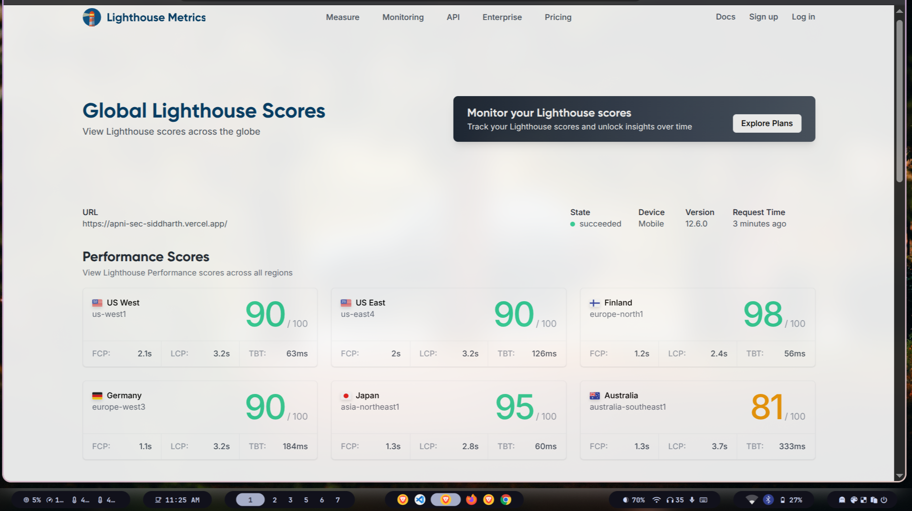

# ApniSec

A full-stack security vulnerability management platform built with Next.js, featuring JWT authentication, issue tracking, and role-based access control.

**Live Demo:** [https://apni-sec-siddharth.vercel.app/](https://apni-sec-siddharth.vercel.app/)



## Overview

ApniSec is a security platform that allows users to report and track vulnerabilities across three categories: Cloud Security, VAPT (Vulnerability Assessment and Penetration Testing), and Reteam Assessment. The application implements a secure REST API with proper authentication, rate limiting, and follows object-oriented programming principles.

## Tech Stack

- **Frontend:** Next.js 15, React, TypeScript, Tailwind CSS
- **Backend:** Next.js API Routes (Node.js)
- **Database:** Supabase (PostgreSQL)
- **Authentication:** JWT with bcrypt password hashing
- **Email:** Resend API for transactional emails
- **Deployment:** Vercel

## Features

### Authentication & Security

- User registration and login with JWT tokens
- Password hashing with bcrypt
- Protected API routes with token validation
- Rate limiting on all endpoints (100 requests per 15 minutes)
- Password reset functionality via email

### Issue Management

- Create, read, update, and delete security issues
- Three issue types: Cloud Security, VAPT, Reteam Assessment
- Issue status tracking (open, in-progress, resolved)
- Filter issues by type or user email
- Pagination support for issue listings
- Public access to view all issues (read-only)

### User Profile

- Update user name
- Change password with old password verification
- View current user profile

## API Endpoints

### Authentication

- `POST /api/auth/register` - Register new user
- `POST /api/auth/login` - User login
- `GET /api/auth/me` - Get current user (requires auth)
- `POST /api/auth/logout` - Logout user

### User Management

- `PUT /api/user/update-name` - Update user name (requires auth)
- `PUT /api/user/update-password` - Update password (requires auth)

### Issue Management

- `GET /api/posts` - Get all issues (public)
  - Query params: `type`, `email`, `start`, `end`
- `POST /api/posts` - Create new issue (requires auth)
- `GET /api/posts/[id]` - Get single issue (requires auth)
- `PUT /api/posts/[id]` - Update issue status (requires auth)
- `DELETE /api/posts/[id]` - Delete issue (requires auth)

## Database Schema

### usersAuth Table

```sql
id (UUID, primary key)
name (TEXT)
email (TEXT, unique)
password (TEXT, hashed)
reset_token (TEXT, nullable)
reset_expires (TIMESTAMP, nullable)
created_at (TIMESTAMP)
updated_at (TIMESTAMP)
```

### posts Table

```sql
id (UUID, primary key)
email (TEXT)
title (TEXT)
type (TEXT) -- 'Cloud Security' | 'VAPT' | 'Reteam Assessment'
description (TEXT)
status (TEXT) -- 'open' | 'in-progress' | 'resolved'
created_at (TIMESTAMP)
updated_at (TIMESTAMP)
```

## Architecture

The backend follows object-oriented principles with these main classes:

- **AuthClass** - Handles user authentication, registration, and JWT operations
- **SbAuthClient** - Manages user database operations (CRUD)
- **SbDataClient** - Manages issue/post database operations
- **RateLimiter** - In-memory rate limiting implementation

### Implementation Highlights

**Custom JWT Authentication**: Implemented from scratch rather than using Supabase's built-in auth, providing full control over token lifecycle and security.

**In-Memory Rate Limiter**: Built a custom rate limiter using JavaScript Maps with automatic cleanup of expired entries. Limits requests to 100 per 15-minute window per IP address. Chose this approach over Redis due to Vercel's serverless constraints.

**RESTful API Design**: All endpoints follow REST principles with proper HTTP methods and status codes. Public read access for issues, authenticated write operations.

**Security**: Passwords hashed with bcrypt (10 salt rounds), JWT tokens with expiration, protected routes with middleware-style auth checks.

## Setup Instructions

1. Clone the repository

```bash
git clone https://github.com/yourusername/apnisec.git
cd apnisec
```

2. Install dependencies

```bash
npm install
```

3. Create `.env.local` file with the following variables:

```env
NEXT_PUBLIC_SB_URL=your_supabase_url
NEXT_PUBLIC_SB_KEY=your_supabase_anon_key
NEXT_PUBLIC_JWT_SECRET=your_jwt_secret
NEXT_PUBLIC_SALT=10
RESEND_API_KEY=your_resend_api_key
```

4. Set up Supabase database tables using the schema provided above

5. Run the development server

```bash
npm run dev
```

6. Open [http://localhost:3000](http://localhost:3000)

## Performance

The application achieves excellent Lighthouse scores across global regions:

- US West: 90/100
- US East: 90/100
- Finland: 98/100
- Germany: 90/100
- Japan: 95/100
- Australia: 81/100

## Environment Variables

| Variable                 | Description                      |
| ------------------------ | -------------------------------- |
| `NEXT_PUBLIC_SB_URL`     | Supabase project URL             |
| `NEXT_PUBLIC_SB_KEY`     | Supabase anonymous key           |
| `NEXT_PUBLIC_JWT_SECRET` | Secret for JWT token signing     |
| `NEXT_PUBLIC_SALT`       | Bcrypt salt rounds (default: 10) |
| `NEXT_PUBLIC_RESEND`     | Resend API key for emails        |
